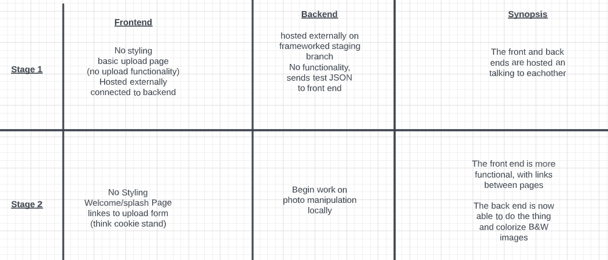
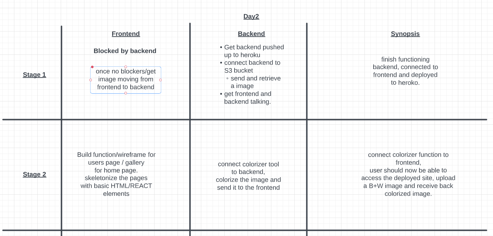

# Day 2, Tuesday June 21, 2022

## Stand up

## What progress did your team make today?

### Back End

- We Created the AWS S3 Bucket
- coded out the fast api backend
- started to configure the api to talk to AWS

### Front End

- started to get the frontend ready to link up to the backend started the backend heroku deployment got openCV to correctly perform the full function of the tool
- Front end deployed to vercel

## Contribution Status

| Name | Front End Commit | Back End Commit | Total Commits |
|------|:------------------:|:-----------------:|---------------:|
| Matt Rangel | 8         | 0               | **8**         |
| Katrina Hill | 4        | 0               | **4**         |
| Bishal Khanal | 2        | 1              | **3**         |
| Benjamin Carter | 0      | 3               | **3**         |
| Roger Wells | 0      | 2               | **2**         |

### Total Commits

1. Matt Rangel: 8 Commits
2. Katrina Hill: 4 Commits
3. Bishal Khanal, Benjamin Carter: 3 Commits
4. Roger Wells: 2 Commits

### Front End Commit

- Matt Rangel: 8 Commits 10,872 ++    10,826 --
- Katrina Hill: 4 Commits 249,986 ++    244,544 --
- Bishal Khanal: 2 Commits 5,220 ++    0 --

### Back End Commit

- Benjamin Carter: 3 Commits 247 ++    8 --
- Roger Wells: 2 Commits 205 ++    96 --
- Bishal Khanal: 1 Commit  1 ++    0 --

## Identify any blockers

### Front End Blocker

- Hook up the back end

### Back End Blocker

#### S3

- Backend Blocker: An error occurred (AccessControlListNotSupported) when calling the PutObject operation: The bucket does not allow ACLs

#### Configuration Issues

Issues to deploy the dockerize container to heroku
just accepts at every stage, when hitting the ned there is nothing there, no connection to application.

Admin, or postgres sql database there, not sure if necessary. Might be in the end of other endpoint.

Solution may need to smash the two back ends together iroiro server backend and iroiro api backend

## Day 2 Morning Parings

**Ben and Katrina Focus**: Morning, Deploying fastApi back to heroku and docker to heroku

**Bishal, Roger, and Matt Focus**: Morning, get AWS bucket set up so we can have access to upload files.

## Day 2 Todo's

