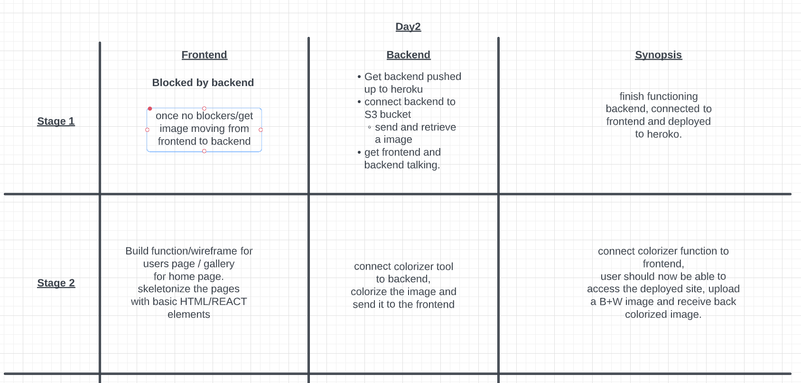

# Day 3, Wednesday, June 22, 2022

## Stand up

## What progress did your team make Yesterday?

### Back End

- Able to get image from front to back, to DB, and back to display in the front.
- S3 Bucket works. Coudn't deploy back end to heroku
  - Rebuilt without docker or S3, and we are able to deploy to Heroku
  - What to do to move forward without to CRUD with colorization function.

### Front End

- Successfully linked to back end

## Contribution Status

| Name | Front End Commit | Back End Commit | Hurricane Colorizer |Total Commits |
|------|:------------------:|:-----------------:|:-----------------:|---------------:|
| Benjamin Carter | 0      | 14               | 1            |   **15**         |
| Matt Rangel | 8         | 1               | 0               | **9**         |
| Katrina Hill | 4        | 1               |0               | **5**         |
| Bishal Khanal | 3        | 1              | 0              | **4**         |
| Roger Wells | 0      | 3               |0               | **3**         |

### Total Commits

1. Benjamin Carter: 15 Commits
2. Matt Rangel: 9 Commits
3. Katrina Hill: 5 Commits
4. Bishal Khanal: 4 Commits
5. Roger Wells: 3 Commits

### [Front End Commit](https://github.com/North-Pac/hurricane-photo-frontend/graphs/contributors)

- Matt Rangel: 8 Commits 10,872 ++    10,826 --
- Katrina Hill: 4 Commits 249,986 ++    244,544 --
- Bishal Khanal: 3 commits    5,265 ++    53 --

### [Back End Commit](https://github.com/North-Pac/hurricane-photo-backend/graphs/contributors)

- Benjamin Carter: 14 commits    535 ++    270 --
- Roger Wells: 3 commits    208 ++    146 --
- Bishal Khanal: 1 commit    1 ++    0 --
- Katrina Hill: 1 commit    3 ++    21 --
- Matt Rangel: 1 commit    1 ++    1 --  

## Identify any blockers

### Front End Blocker

- None at this time

### Back End Blocker

Deploying to backend with DB to get CRUD functionality

### To Do

## Day 3 Morning Parings

**TBD**:

**TBD**:

## Day 3 Todo's
